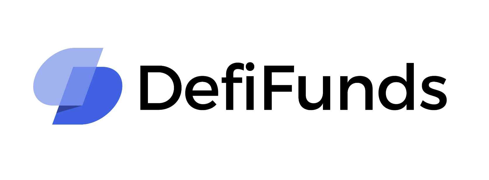

# DefiFunds on Betanet V2

This is a proof-of-concept dapp that lets you manage or invest in a fund. As a fund manager, you will be able to trade cryptocurrencies and collect a fee from those who want to join your fund. If you do not want to create a fund, you can also invest in a fund that someone else has created. The fund manager will then do the trading for you. You do not need to trust the fund manager to hold your funds. They are kept securely in a vault and can only be traded with whitelisted tokens by the fund manager. He has never access to withdraw your funds.

The dapp is still under development, so when testing out this dapp the UI will be very poor. If you want to see how it should look like when it is finished you can check out this [link](https://www.figma.com/file/dxSKJUxvfyQ3e2wKqYOtJT/Tobias_eth?node-id=0%3A1&t=imOUxtVIg1waaQtM-1)

I am building this dapp for my master's thesis and hope to have the dapp ready when smart contracts go live on mainnet. I also wrote about this dapp in my specialization project, so feel free to read the [pdf](https://github.com/tobben1998/scrypto/blob/master/defi_fund/DefiFunds_-_A_proof_of_concept_Dapp_built_on_Radix.pdf)

## Pre-requisites

1. Node >= 12.17.0
2. The Betanet wallet & Radix-connector browser extension installed. Instructions [here](https://docs-babylon.radixdlt.com/main/getting-started-developers/wallet-and-connector.html)

## Interacting with DeFiFunds

1. In a terminal go to the to the root of this project (defi_fund)
2. Install the npm dependencies: `npm install`
3. Start the local server with `npm start`
4. Open up your browser at the provided url if it doesn't open automatically.
5. Make sure you created an account on the wallet and added funds via the faucet by clicking on account name and then the three dots a button to get XRD from faucet should open.
6. Click on the connect button to fetch your wallet address. Confirm login with your phone. You should see your address appearing.
7. You can now start testing the different functions and methods on the blueprint

### New Fund

If you want to test being a fund manager, you can create a new fund using the new Fund method. Fill in the fields, and press the Create Fund button.

### Choose what fund you interact on

Scroll down to "Get Funds in DefiFunds". Press the get button to see all the created funds.
Select the fund you want to interact on by setting Fund, FundManger and Sharetoken.

### Trade Beakerfi

This method is only for the fund manager. When you use this method you will trade with the tokens in the fund.
Select the amount you want to trade. The token you want to trade from, and the pool you want to trade with. You will trade using the pools from beaker.fi

### Deposit tokens to fund

If you want to buy part of a fund you can call this method. The method will buy up tokens equal to the ratio in the fund using beaker.fi, and deposit those tokens into the fund.
You will receive sharetokens in return.

### Withdraw tokens from fund

When you want to sell your share of the fund you can use this method. By calling this method you will take out your share of all the different tokens in the fund, and then use beaker.fi to swap those tokens into the specific token you want.
